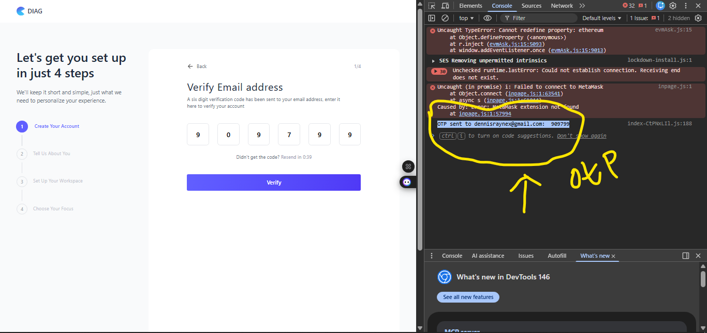

# NooluHQ

A modern web application for onboarding and workspace management with robust authentication, onboarding flow, and dashboard analytics. Built with React, Redux Toolkit, Redux Persist, and React Router, with a clean modular structure.

---

## Table of Contents

- [Features](#features)
- [Tech Stack](#tech-stack)
- [Getting Started](#getting-started)
- [Project Structure](#project-structure)
- [Authentication & Onboarding Flow](#authentication--onboarding-flow)
- [Running the App](#running-the-app)
- [Available Scripts](#available-scripts)
- [Contributing](#contributing)
- [License](#license)

---

## Features

- **User Authentication**
  - Email signup/login
  - Token-based authentication with accessToken & onboardingToken
  - Automatic token expiration handling

- **Onboarding Flow**
  - Multi-step onboarding with progress persistence
  - Supports continuing onboarding after page refresh
  - Onboarding tokens protect onboarding pages until full authentication

- **Dashboard & Analytics**
  - Authenticated routes for dashboard, analytics, reports, settings, and integrations
  - Role-based access (planned for future versions)

- **State Management**
  - Redux Toolkit for structured global state
  - Redux Persist for storing tokens and onboarding progress in localStorage
  - Custom hooks (`useAuthBootstrap`, `useOnboardingProgress`) to manage auth and onboarding state

- **API Integration**
  - Axios client with interceptors for automatic token injection
  - Handles both onboardingToken and accessToken properly
  - Graceful error handling for 401 and expired tokens

---

## Tech Stack

- **Frontend**: React, TypeScript, Tailwind CSS
- **State Management**: Redux Toolkit, Redux Persist
- **Routing**: React Router v6
- **API Client**: Axios
- **Hooks**: Custom hooks for auth and onboarding flow
- **Development Tools**: React Query, Lucide Icons

---

## Getting Started

### Prerequisites

- Node.js >= 22
- npm >= 9
- Optional: Postman or Insomnia for API testing

### Installation

```bash
git clone <your-repo-url>
cd <project-folder>
npm install
```

## OTP Testing

During development, the app uses **Resend** for email-based OTPs.

⚠️ Note: OTP delivery is limited in this project due to Resend's default testing environment (`onboarding@resend.dev`).

- Emails are only sent to a single verified email address.
- Any other email used during registration will **not receive an OTP**.
- For testing purposes, the OTP is logged in the console instead.

To enable real OTP delivery for multiple users, a custom domain must be configured and verified in Resend.

For convenience during development, OTPs are **logged to the browser console**. You can view them in the developer tools:



**Example:**

```text
OTP sent to miracle56899@e-record.com: 123456
```

## Technical Notes

### Token Management

- **accessToken** → Full authentication, required for dashboard and authenticated routes.
- **onboardingToken** → Used during onboarding, allows mid-onboarding route access.
- Tokens are persisted via **redux-persist** and hydrated automatically on app load.

### Route Protection

- `ProtectedRoute` differentiates between onboarding pages and fully authenticated pages.
- Onboarding pages are protected with `onboardingToken`.
- Authenticated pages require a valid `accessToken`.

### API Interceptor

- Axios interceptor injects the correct token (`accessToken` or `onboardingToken`) into requests.
- Handles token expiration gracefully, avoiding premature logout during onboarding.
- Logs token usage for debugging.

### Onboarding Progress

- **Source of truth:** Backend database (persisted across sessions).
- Fetched and cached using **React Query**, which acts as the primary client-side source of truth.
- Uses **optimistic updates** to immediately reflect progress changes in the UI before server confirmation.
- React Query cache ensures fast access and reduces unnecessary API calls.
- On refresh, progress is re-fetched and rehydrated from the backend, maintaining consistency.
- Supports seamless continuation of onboarding from the last completed step.

> React Query cache is treated as the client-side source of truth, synchronized with the backend.

### OTP Handling

- During development, OTPs are logged to the console for testing purposes.
- Email delivery is limited because the project uses Resend's default testing domain (`onboarding@resend.dev`).
- This setup only allows sending emails to a single verified address.
- Any other email used during registration will **not receive an OTP**.

> To enable OTP delivery for multiple users, a custom domain must be configured and verified in Resend.

```

```
